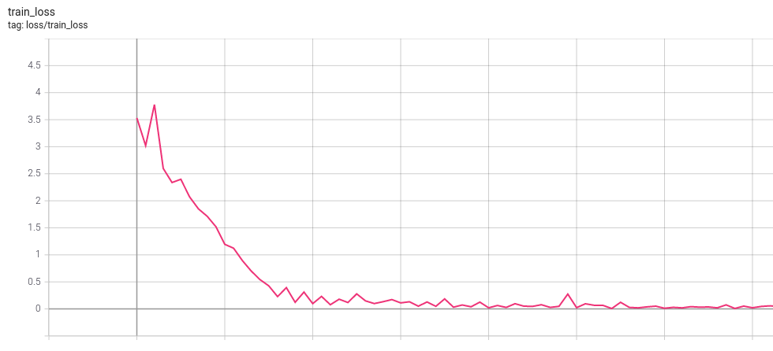
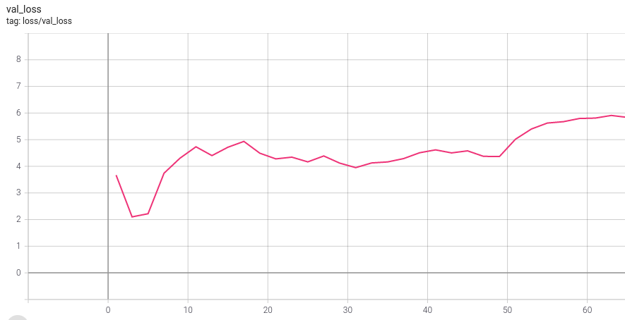
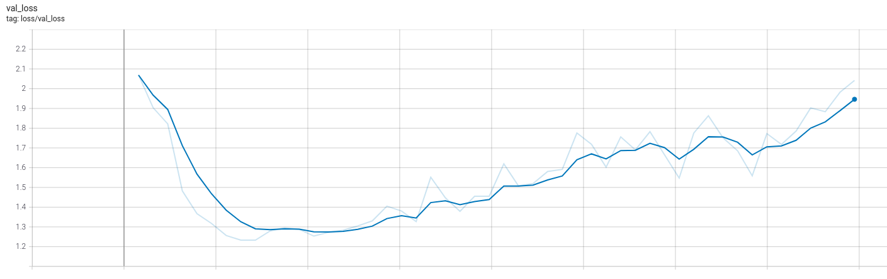
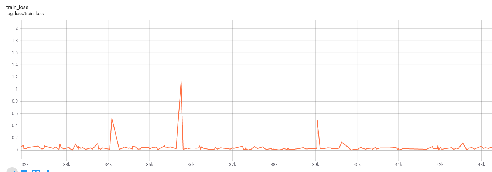

# The ultimate guide to speech recognition

This guide has the purpose to give you all the steps necessary to achieve a decent (but not necessarily state-of-the-art) speech recognition system in a new language.


## Gathering the data

Speech recognition systems are really sensitive to the quality of data used to train them.
Also, they usually require from hundreds to thousands of hours depending on the quality expected.

Some good sources for data are [Mozilla commonvoice](https://commonvoice.mozilla.org/en/datasets), the [OpenSLR project](https://openslr.org/resources.php) or [Tatoeba](https://tatoeba.org/en/).

After you download some initial data, there's a number of data quality problems that are expected and need to be fixed if you want to increase the performance of the trained models.
First, list all the audio files by increasing size and check if there's any corrupted file (usually they're very small).
Remove them from the training data.

Then install [sox](http://sox.sourceforge.net/), that's the best tool to inspect and convert audio files.
It should come with a basic tool to inspect any file in the terminal, called `soxi`. As an example:

```
$ soxi example_file.wav

Input File     : 'example_file.wav'
Channels       : 1
Sample Rate    : 16000
Precision      : 16-bit
Duration       : 00:00:04.27 = 94053 samples ~ 319.908 CDDA sectors
File Size      : 188k
Bit Rate       : 353k
Sample Encoding: 16-bit Signed Integer PCM
```

That's the usual format of files used in speech recognition research.
Wav files, encoded with a 16-bit PCM codec and a sample rate of 16 kHz.
The file format and codec can vary and will only affect the quality of the audio, but the sample rate is the essential one.
Trained models only work with a specific sample rate, and any file with a different one must be resampled either at the file
level or directly after loading with torchaudio.

Sox has more capabilities than just listing audio metadata.
It can read almost any file format and convert to others.
If you have a mp3 file at 44.1 kHz, and want to convert into the usual wav format above, you can use:

```
sox input_file.mp3 -r 16000 -c 1 -b 16 output_file.wav
```

The flags used represent:

* `-r 16000`: 16 kHz sample rate
* `-c 1`: convert to mono (1 channel)
* `-b 16`: convert to PCM 16-bit
* `output_file.wav`: Sox understand that the output will be wav just by the file extension

Ideally all the training and inference audio files should have the same characteristics, so it's a good idea to transform them into a common format before training.
As the wav format does not have any compression, the resulting data will demand a huge HDD space.
If that's a problem, you can instead convert the files to mp3, that way you lose a small percentage of the performance but can achieve up to 10x smaller dataset sizes.

Now take a look at the labels. We are searching for a number of different problems here:

* Strange symbols: can easily find if you list all unique characters in the dataset
* Text in another language: remove these files
* Additional info that should not be there, like speaker identification as part of the transcription (common in subtitles)
* Regional/temporal differences that can cause the same words to have multiple written forms: mixing data from multiple countries that speak the same language, or using labels that came from old books

Try to fix those label problems, or remove them from the training set if you have lots of data.
Don't spend weeks just looking at the data, but have a small subset that you can trust is properly cleaned, even if that means manually labeling again.
After you train the first couple of models, it's possible to use the model itself to help find problems in the training data.

## Loading the data

The first step to train a speech recognition model is to load the collected data into the specific format the model expects.
Usually, data from different sources will have unique ways in that the label is encoded.
Sometimes it's multiple `.txt` files, one for each audio.
Another popular option is to have some `.csv` or `.json` file with the metadata of multiple examples.

The recommendation here is that you convert all the labels to the same format before training.
This will simplify the data loading, and any tools that you build to inspect the data can be shared between datasets.
There's no obvious choice here, but the nemo manifest format has some pros:

* It's easy to save and version the manifest, to have fully reproducible training
* An increasing number of tools support it, including [NeMo](https://developer.nvidia.com/nvidia-nemo) and [Label Studio](https://labelstud.io/guide/export.html#ASR-MANIFEST).
* The code to load the metadata is simple and intuitive
* It can store additional metadata as necessary

In this format, each of the train/validation/test splits has one file containing the metadata. It has the extension `.json`,
and contains one json in each line, with the relevant data to one example:

```
{"audio_filepath": "commonvoice/pt/train/22026127.mp3", "duration": 4.32, "text": "Quatro"}
{"audio_filepath": "commonvoice/pt/train/23920071.mp3", "duration": 2.256, "text": "Oito"}
{"audio_filepath": "commonvoice/pt/train/20272843.mp3", "duration": 2.544, "text": "Eu vou desligar"}
```

These three keys for each example are required:

* **audio_filepath**: Contains the path to the input audio
* **duration**: has the duration of the audio, in seconds
* **text**: that's the corresponding label

Make sure that each example starts and end in the same line.
This is one example of invalid manifest:

```
{"audio_filepath": "example1.mp3", "duration": 1.0, "text": "This label starts
in one line but
has multiple line breaks
making this manifest
invalid"}
{"audio_filepath": "example2.mp3", "duration": 2.0, "text": "this label is really long similar to the one above it, but it's contained into a single line making it valid"}
```

To load this data, the corresponding `LightningModule` is already implemented:

```python
from thunder.data.datamodule import ManifestDatamodule
datamodule = ManifestDatamodule("train_manifest.json", "val_manifest.json", "test_manifest.json", batch_size = 32)
```


## First train

For this first train, you should only try to overfit one batch.
This is the simplest test, and if you can't get past it then anything
more complex that you try will be wasted time.

To do it, try to load a training dataset with only one batch worth of data.
The validation/test sets can be as usual, you will ignore them at this step.
As we are using pytorch lightning, there's a trainer flag to limit the number of training batches (`limit_train_batches=1`) that can be used.
Also, remember to disable any shuffle at the dataloader, to ensure the same batch will be used every epoch.


Before you run the training, disable any augmentation, regularization and advanced stuff like learning rate scheduling. You can start with either a pretrained model, or a clean new one,
but either way don't freeze any parameters, just let it all train.

Start the training, and you should see the loss follow a pattern where, the more time you let it run,
the final value will be lower. This means that small bumps will happen, but it will always recover
and keep going down. The ideal point is where you run the prediction on the batch that you overfit,
and the model doesn't make a single mistake.

Expected train loss:



The validation loss is not important at this stage, we are trying to overfit on purpose to check if the model is learning correctly.
It's possible to notice that it improved in the first epoch, but instantly went back up and keep increasing as the training goes.

Expected validation loss:



Some problems that can happen:

* **The train loss doesn't go below a certain value**: Check if it' always the same batch being trained. It can happen when you forget to disable the shuffling in the train dataloader.

* **The train loss is negative**: There's a blank in the target text, find and remove it. Blanks should only be produced by the model, never at the labels.

* **There are no predictions at all**: let it train for more time

* **Still, there are no predictions after a long time**: Check if the target texts are being processed correctly. Inside the training step, decode the target text and assert that it returns what you expect

* **The train loss just keep increasing**: try to lower the learning rate

## Second train

Now repeat the first training, but with around 10 hours of data.
This number depends on the hardware that you have available,
but something that gives you 2 minute epochs is a good amount.

This time, you're not trying to overfit anymore.
The validation loss will start to get lower,
and the metrics will improve compared to the first training.
Quickly, the model will reach the point where the data is enough, and it will start to overfit to the training data.


Expected train loss:


Expected validation loss:




At this point the model is still overfitting, but it should be way less than the first train.
The objective of this training round is to confirm that the model performance improves as the amount of training data increases, and also to find any problems that were not caught when using only a single batch.

## Scaling to the whole dataset

Now that we confirmed the model is training properly, it's time to use all the training data available.
Remember that speech recognition models are really sensitive to the quality of the labels, and transcription errors across the dataset can make the training unstable.
The improvements from cleaning the labels and collecting more data can be an order of magnitude higher than using the new fancy SOTA model of the month with mislabeled data.


Some tips at this step:

* **break long audios**: more than 25 seconds is usually bad for each train example, it can cause catastrophic forgetting on sequence based models, or out-of-memory errors
* **Use the model to find problems**: After the first few models are trained, they can be used to aid while cleaning the data:
    * Sort by train loss descending and manually check the files. This will show the examples where the model is having the most difficult to learn, and that can be caused by bad data or outliers
    * Sort by Character Error Rate (CER) descending and manually check the files. Similar to the test above, but this time sorting by the character error rate. Most of the top audios will be the same, but this test can also show new problematic ones.
    * Sort by CER ascending on the validation/test set to find possible data leak. If there's some data repeated between train and validation/test, the metrics will be lower compared to samples that are new to the model.

* **Watch for the loss spikes during training**: Sometimes the loss will have spikes as show in the next figure, where it went from around 0.1 to 1.1 during a single step. This can be caused by mislabeled data, try to log the full batch when this happens and check manually.




## Reducing overfit

To reduce the overfit in trained models, follow the recipe given by [fast.ai](https://youtu.be/4u8FxNEDUeg?t=1333), in this order of priority:

1. Add more data
2. Data augmentation
3. Generalizable architectures
4. Regularization
5. Reduce architecture complexity

While adding more data, try to follow the tips in the [Scaling to the whole dataset](#scaling-to-the-whole-dataset) section to use trained models to find problem in the new data.
Also, when doing any of the other steps, it's best to repeat the [Second train](#second-train) to quickly confirm that the modified model is still training properly.

## Deploy!

Finally, it's time to deploy the trained model.
This includes exporting the model, writing the data pipelines, building the server/mobile app where the model will run and monitoring.

The recommended way to export models is using torchscript.
This will ensure that they preserve correct behaviour, and every model implemented in this library is rigorously tested to be compatible with it.
Pytorch tracing and onnx are also tested to export, but those methods have limitations around variable input shapes.

The audio loading and preprocessing is also implemented as a `nn.Module`, so that it can be scripted and exported for inference.
It exists as the `.loader` attribute inside the datasets, or can be directly instantiated from `thunder.data.dataset.AudioFileLoader`.
This way, there's no need to reimplement the input pipeline when deploying the model.
As a bonus, the exported models using torchscript remove the dependency on thunder, only pytorch is necessary to run the model, and optionally torchaudio to load the audio data using `AudioFileLoader`.


It's possible to use the torchscript model inside a mobile app.
Before exporting, one patch need to be applied so that operations that are not natively supported on mobile are changed to compatible implementations. One example of implementing a simple speech recognition app can be found [here](https://github.com/scart97/quartznet-android).


To learn more about deployment and MLOps, there are free courses from [made with ml](https://madewithml.com/#mlops) and [full stack deep learning](https://fullstackdeeplearning.com/) that go in depth.
